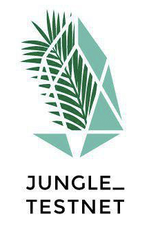

	

	
	

## Description 
EOS Jungle Testnet Community Website [jungletestnet.io](http://jungletestnet.io)

[EOS Jungle Testnet Monitor](http://jungle.cryptolions.io/)

## Contributing

PRs accepted.
Please look through our [open issues](https://github.com/EOS-Jungle-Testnet/jungletestnet.io/issues) we are all about open source.

Please report bugs big and small by [opening an issue](https://github.com/EOS-Jungle-Testnet/jungletestnet.io/issues).

We use a Kanban-style board with built-in triggers to automatically move issues and pull requests across New Issues, To Do, In Progress and Done columns. That's were we prioritize the work. [Go to Project Board](https://github.com/EOS-Jungle-Testnet/jungletestnet.io/projects/4).

We follow EOS Costa Rica's Open Source Contributing Guidelines. [https://learn.eoscostarica.io/open-source/](https://learn.eoscostarica.io/open-source/)

Small note: If editing the Readme, please conform to the [standard-readme](https://github.com/RichardLitt/standard-readme) specification.

## Weekly Call

Our weekly sync call is every Friday 3pm UTC at [meet.eoscostarica.io](https:/meet.eoscostarica.io).

- Please review our weekly meeting agenda agenda and minutes in the following shared [Google Drive Folder](https://drive.google.com/drive/folders/1AoXnpLLyF84GWfK91xR42kouDnbPL3Dw?usp=sharing)

## License

MIT © [Jungle Testnet](https://jungletestnet.io)  

